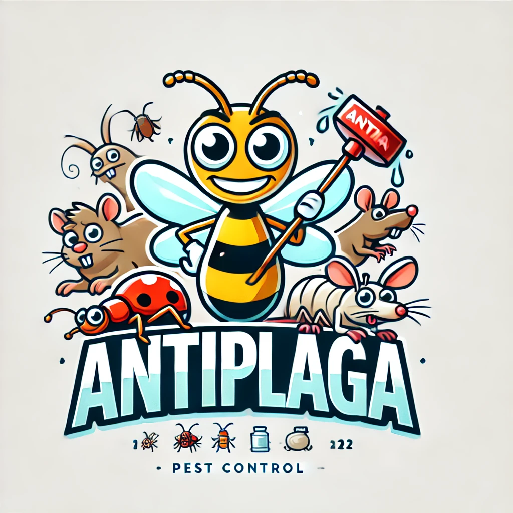

# Antiplaga Tech Application

## Requerimientos
- Ionic V8 (definida en package.json. No hay que instalar nada)
- Android Studio SDK Target (SDK 34) (Seleccionar al instalar Android Studio)
- Java 17 (Seleccionar al configurar Android Studio)
- Node v22.7.0 (Se instala con nvm)
- Ionic cli 7.2 (Se instala con el comando de abajo)

Se recomienda el uso de NVM para gestionar las distintas versiones de Node.

Se usa [Capacitor](https://capacitorjs.com/docs/android) en su versión 8 para buildear la aplicación en Android. (Ya viene adentro del repositorio. No hay que instalar nada)

Instalar CLI de Ionic
```
npm install -g @ionic/cli
```


## Instalación

Asegurar tener instalado todo el software mencionado en el punto anterior con cada una de las versiones especificadas.


1. Clonar el repositorio de git
2. Instalar las dependencias de npm con `npm install`
3. Para ejecutar el entorno de desarrollo local, ejecutar `ionic serve`

Para buildear el proyecto y crear un `.apk` para android, se debe:
1. Buildear el proyecto de React con `ionic build`
2. Copiar los archivos a capacitor con `ionic cap copy`
3. En caso que se modifiquen archivos propios al sistema operativo de android (como el manifest) se debe ejecutar `ionic cap sync`
4. Abrir Android Studio con `npx cap run android` o a mano.
5. Buildear con la tool nativa de Android Studio


El output se generará en la carpeta root del proyecto
```
android\app\build\outputs\apk\debug
```
